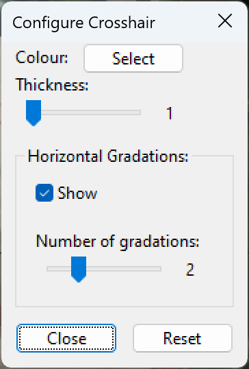

MicroscoPy-Xhair is a simple USB microscope viewer, which draws a crosshair onto the image provided from a USB camera; it is compatible with Microsoft Windows. MicroscoPy-XHair has been developed for use with the Bruker-AXS Capillary Alignment Microscope, but it can be used with any USB microscope or indeed any USB camera.

# Installation

MicroscoPy-XHair is available either as a portable executable or a setup-exe. The setup-exe allows the user to install the program into the Program Files directory which allows it to start faster. The portable executable can be copied onto any computer, but is slower to start.

Click the following links to download:

* [Setup-exe](./resources/MicroscoPyXhair-setup.exe)
* [Portable Executable](./resources/MicroscoPyXhair.exe)

# Using MicroscoPy-XHair
## Starting MicroscoPy-XHair

If MicroscoPy-XHair was installed with the setup-exe, it can be started from the Windows Start Menu. If the portable executable was copied to the computer, simply double click on the file and wait for it to start.

When the program starts, the view from the default USB camera is shown with a crosshair drawn. The following sections describe how to configure the active camera and configure the crosshair.

## Selecting the Active Camera
The active USB camera can be selected using the following steps:
1. Select the *Active Camera* Option from the File Menu (*File -> Active Camera*).
2. Click on the dropdown menu and select the camera you want to use.
  - The **last** camera in the list is selected by default.
3. Click OK.

The main view will pause briefly and the view from the selected camera will be shown.

## Configuring MicroscoPy-XHair
By default, the crosshair drawn on the camera image is black and has a thickness of 1 pixel. In addition to the main vertical and horizontal lines, two *horizontal gradations* (shown as dashed lines) are also shown above and below the horizontal line.

Options related to drawing style of the crosshair can be found in the *Configure crosshair...* option on the File menu (*File -> Configure crosshair...*).

The crosshair is also centered in the middle of the camera image - this can also be changed.

### Configuring the Style of the Crosshair
The style of the crosshair can be controlled from the *Configure Crosshair* window (*File -> Configure crosshair...*). Changes are immediately applied to the crosshair.

**To change the colour of the crosshair,** click on the *Select* button next to *Colour*. Choose a colour in the colour-picker window which is then shown and click OK.

**To change the thickness of the crosshair,** drag the slider labelled *Thickness* left and right. The width of the crosshair lines (in pixels) is shown to the right of the slider.

**To hide the horizontal gradations,** click the *Show* checkbox under the label *Horizontal Gradations*.

**To change the number of horizontal gradations,** drag the slider labelled *Number of gradations* left and right. The number of gradations drawn above and below the horizontal center line of crosshair is shown to the right of the slider.

### Changing the Position of the Crosshair
To change the position of the crosshair, double right-click at the desired center position of the crosshair. The crosshair (as well as the horizontal gradations) are immediately recentered on the selected position.

**Note:** After restarting the program, the crosshair will be centered on the middle of the camera image again.
